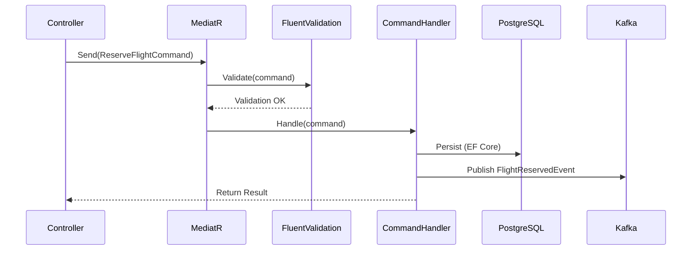
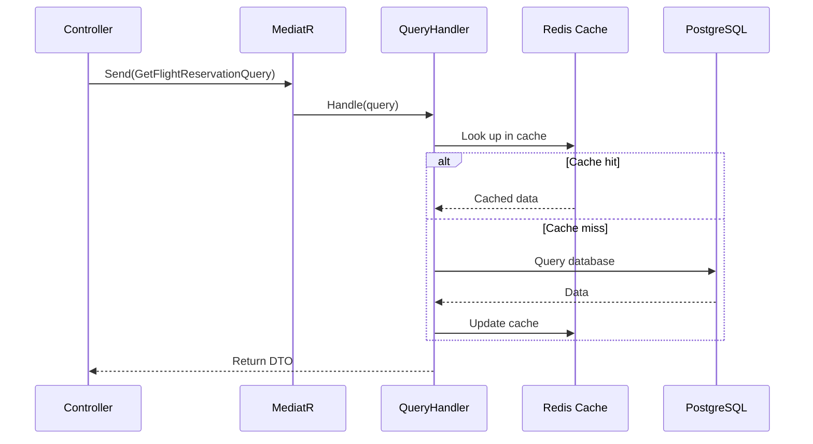

# CQRS - Command Query Responsibility Segregation

## What is CQRS?

CQRS is a pattern that **separates read operations (Query) from write operations (Command)** into distinct models. Instead of a single model that serves both reading and writing, we have:

- **Command Model**: Optimized for writing (validation, business rules, persistence)
- **Query Model**: Optimized for reading (materialized views, cache, projections)

## Why use CQRS in this project?

1. **Separation of concerns**: Commands process business rules; Queries return formatted data
2. **Independent scalability**: We can scale reads and writes separately
3. **Optimization**: The read model can be denormalized for fast queries
4. **Natural integration with Event Sourcing**: SAGA events feed the read projections

## Implementation with MediatR

We use **MediatR** as a mediator to route Commands and Queries to their respective Handlers.

### Command Structure

```
Application/
├── Commands/
│   ├── ReserveFlightCommand.cs          # What to do (input data)
│   └── ReserveFlightCommandHandler.cs   # How to do it (business logic)
├── Queries/
│   ├── GetFlightReservationQuery.cs     # What to fetch
│   └── GetFlightReservationQueryHandler.cs  # How to fetch it
└── Validators/
    └── ReserveFlightCommandValidator.cs # Validation (FluentValidation)
```

### Command Flow



### Query Flow



## CQRS in Booking.Orchestrator

The Orchestrator has a special CQRS implementation with **Event Sourcing**:

### Write Side (Event Store)

The SAGA state is reconstructed from a sequence of events:

```
Event 1: BookingStartedEvent        { bookingId, items, timestamp }
Event 2: FlightReservedEvent        { bookingId, flightId, timestamp }
Event 3: CarReservedEvent           { bookingId, carId, timestamp }
Event 4: HotelReservationFailedEvent { bookingId, reason, timestamp }
Event 5: CompensationStartedEvent   { bookingId, stepsToCompensate, timestamp }
Event 6: CarCancelledEvent          { bookingId, carId, timestamp }
Event 7: FlightCancelledEvent       { bookingId, flightId, timestamp }
Event 8: BookingFailedEvent         { bookingId, reason, timestamp }
```

To reconstruct the current state: replay all events in order.

### Read Side (Redis)

The Orchestrator maintains a **materialized projection** in Redis with the current SAGA status:

```json
{
  "bookingId": "abc-123",
  "status": "COMPENSATING",
  "items": {
    "flight": { "status": "CANCELLING", "flightId": "FL-456" },
    "car": { "status": "CANCELLED", "carId": "CR-789" },
    "hotel": { "status": "FAILED", "reason": "No availability" }
  },
  "createdAt": "2026-03-15T10:00:00Z",
  "updatedAt": "2026-03-15T10:00:45Z"
}
```

This projection is updated on each event and allows instant queries without replay.

## CQRS in Domain Services (Flight, Car, Hotel)

In domain services, the implementation is simpler (no Event Sourcing):

### Commands
- `ReserveFlightCommand` → Creates reservation in PostgreSQL + publishes event to Kafka
- `ConfirmFlightCommand` → Updates status to confirmed
- `CancelFlightCommand` → Compensation (cancels reservation)

### Queries
- `GetFlightReservationQuery` → Fetches reservation by ID
- `GetFlightAvailabilityQuery` → Lists available flights

### Controller Example

```csharp
[ApiController]
[Route("api/v1/flights")]
public class FlightController : ControllerBase
{
    private readonly IMediator _mediator;

    // Command (write)
    [HttpPost("reserve")]
    public async Task<IActionResult> Reserve(ReserveFlightCommand command)
        => Ok(await _mediator.Send(command));

    // Query (read)
    [HttpGet("availability")]
    public async Task<IActionResult> GetAvailability([FromQuery] GetFlightAvailabilityQuery query)
        => Ok(await _mediator.Send(query));
}
```

## Consistency between Write and Read

The consistency between the write model (PostgreSQL) and read model (Redis) is **eventual**:

1. Command Handler persists to PostgreSQL
2. Command Handler publishes event to Kafka
3. A consumer updates Redis with the new data

The delay is typically milliseconds, but the system accepts that reads may be slightly stale.
