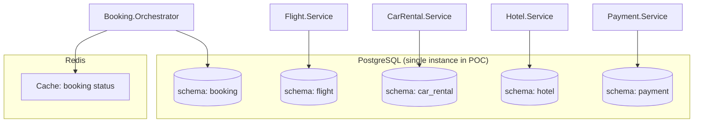

# Database Strategy

## Database per Service

Each microservice has its **own schema** in PostgreSQL, ensuring:
- **Isolation**: A service does not directly access another's data
- **Autonomy**: Each service can evolve its schema independently
- **Encapsulation**: Data is accessed only via the service's API

### POC Topology

In the POC, we use a **single PostgreSQL instance** with separate schemas. In production, each service would have its own instance.



> See [ADR-004](../adr/004-database-per-service.md)

## Schemas per Service

### booking (Booking.Orchestrator)

| Table | Purpose |
|-------|---------|
| `saga_events` | Event Store - all SAGA events (append-only) |
| `saga_snapshots` | Periodic snapshots to optimize replay |

```sql
CREATE TABLE saga_events (
    id BIGSERIAL PRIMARY KEY,
    booking_id UUID NOT NULL,
    event_type VARCHAR(100) NOT NULL,
    event_data JSONB NOT NULL,
    correlation_id UUID NOT NULL,
    created_at TIMESTAMPTZ NOT NULL DEFAULT NOW(),
    sequence_number INT NOT NULL
);

CREATE INDEX idx_saga_events_booking_id ON saga_events(booking_id);
CREATE UNIQUE INDEX idx_saga_events_booking_sequence
    ON saga_events(booking_id, sequence_number);
```

### flight

| Table | Purpose |
|-------|---------|
| `flights` | Available flights catalog |
| `flight_reservations` | Flight reservations |

```sql
CREATE TABLE flights (
    id UUID PRIMARY KEY,
    flight_number VARCHAR(10) NOT NULL,
    origin VARCHAR(3) NOT NULL,        -- IATA code
    destination VARCHAR(3) NOT NULL,   -- IATA code
    departure_at TIMESTAMPTZ NOT NULL,
    arrival_at TIMESTAMPTZ NOT NULL,
    available_seats INT NOT NULL,
    price_per_seat DECIMAL(10,2) NOT NULL
);

CREATE TABLE flight_reservations (
    id UUID PRIMARY KEY,
    booking_id UUID NOT NULL,
    flight_id UUID NOT NULL REFERENCES flights(id),
    passenger_name VARCHAR(200) NOT NULL,
    status VARCHAR(20) NOT NULL,  -- RESERVED, CONFIRMED, CANCELLED
    created_at TIMESTAMPTZ NOT NULL DEFAULT NOW(),
    updated_at TIMESTAMPTZ NOT NULL DEFAULT NOW()
);
```

### car_rental

| Table | Purpose |
|-------|---------|
| `vehicles` | Available vehicles catalog |
| `car_reservations` | Car rental reservations |

```sql
CREATE TABLE vehicles (
    id UUID PRIMARY KEY,
    model VARCHAR(100) NOT NULL,
    category VARCHAR(20) NOT NULL,  -- ECONOMY, COMPACT, SUV, LUXURY
    location VARCHAR(100) NOT NULL,
    daily_rate DECIMAL(10,2) NOT NULL,
    is_available BOOLEAN NOT NULL DEFAULT TRUE
);

CREATE TABLE car_reservations (
    id UUID PRIMARY KEY,
    booking_id UUID NOT NULL,
    vehicle_id UUID NOT NULL REFERENCES vehicles(id),
    renter_name VARCHAR(200) NOT NULL,
    pickup_date DATE NOT NULL,
    return_date DATE NOT NULL,
    status VARCHAR(20) NOT NULL,  -- RESERVED, CONFIRMED, CANCELLED
    created_at TIMESTAMPTZ NOT NULL DEFAULT NOW(),
    updated_at TIMESTAMPTZ NOT NULL DEFAULT NOW()
);
```

### hotel

| Table | Purpose |
|-------|---------|
| `rooms` | Available rooms catalog |
| `hotel_reservations` | Hotel reservations |

```sql
CREATE TABLE rooms (
    id UUID PRIMARY KEY,
    hotel_name VARCHAR(200) NOT NULL,
    room_type VARCHAR(20) NOT NULL,  -- SINGLE, DOUBLE, SUITE
    city VARCHAR(100) NOT NULL,
    nightly_rate DECIMAL(10,2) NOT NULL,
    is_available BOOLEAN NOT NULL DEFAULT TRUE
);

CREATE TABLE hotel_reservations (
    id UUID PRIMARY KEY,
    booking_id UUID NOT NULL,
    room_id UUID NOT NULL REFERENCES rooms(id),
    guest_name VARCHAR(200) NOT NULL,
    check_in DATE NOT NULL,
    check_out DATE NOT NULL,
    status VARCHAR(20) NOT NULL,  -- RESERVED, CONFIRMED, CANCELLED
    created_at TIMESTAMPTZ NOT NULL DEFAULT NOW(),
    updated_at TIMESTAMPTZ NOT NULL DEFAULT NOW()
);
```

### payment

| Table | Purpose |
|-------|---------|
| `transactions` | Financial transaction records |

```sql
CREATE TABLE transactions (
    id UUID PRIMARY KEY,
    booking_id UUID NOT NULL,
    amount DECIMAL(10,2) NOT NULL,
    currency VARCHAR(3) NOT NULL DEFAULT 'BRL',
    status VARCHAR(20) NOT NULL,  -- PENDING, COMPLETED, REFUNDED, FAILED
    payment_method VARCHAR(50) NOT NULL,
    created_at TIMESTAMPTZ NOT NULL DEFAULT NOW(),
    updated_at TIMESTAMPTZ NOT NULL DEFAULT NOW()
);
```

## Redis (Read Store)

Redis is used as a **read store** in the Booking.Orchestrator for CQRS:

### Redis Data Structure

```
Key: booking:{bookingId}
Value: JSON with current SAGA status (materialized projection)
TTL: 24 hours (configurable)

Key: booking:{bookingId}:history
Value: Event list (for history UI)
TTL: 24 hours
```

### Package: StackExchange.Redis

```csharp
// Usage example
await _redis.StringSetAsync(
    $"booking:{bookingId}",
    JsonSerializer.Serialize(bookingStatus),
    TimeSpan.FromHours(24)
);
```

## EF Core: Configuration

Each service configures its own `DbContext`:

```csharp
public class FlightDbContext : DbContext
{
    protected override void OnModelCreating(ModelBuilder modelBuilder)
    {
        modelBuilder.HasDefaultSchema("flight");
        // ... entity configurations
    }
}
```

### Migrations

Each service manages its own migrations:

```bash
dotnet ef migrations add InitialCreate --project src/Services/Flight.Service
dotnet ef database update --project src/Services/Flight.Service
```

## Seed Data

Initial data for development:
- 10 flights (various routes)
- 10 vehicles (different categories)
- 10 rooms (different hotels and types)

The seed script runs automatically on the first `docker-compose up`.
