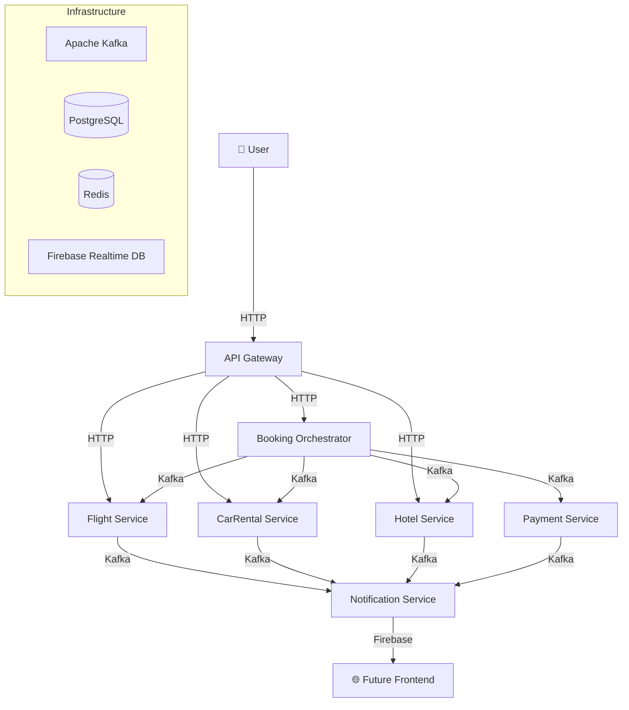

# Architecture Overview

## Context Diagram (C4 - Level 1)



## Microservices

### Booking.Orchestrator (PROJECT STAR)
**Bounded Context:** Booking/Reservation

The heart of the system. Implements the **state machine** that orchestrates the entire SAGA. Receives the booking request, determines which steps are needed (based on requested items), and coordinates sequential execution with automatic compensation on failure.

- Publishes commands to Kafka for each service
- Consumes replies (success/failure) via Kafka
- Maintains SAGA state with Event Sourcing
- Caches status in Redis for fast queries

### Flight.Service
**Bounded Context:** Flights/Air Tickets

Manages the flight reservation lifecycle: reserve, confirm, and cancel (compensation). Implements CQRS internally with MediatR.

### CarRental.Service
**Bounded Context:** Car Rental

Manages car rental reservations. Same internal architecture as Flight.Service.

### Hotel.Service
**Bounded Context:** Accommodation

Manages hotel room reservations. Same internal architecture as Flight.Service.

### Payment.Service
**Bounded Context:** Payments

Processes charges and refunds. Simulates a payment gateway. Critical for the SAGA as it's the last step before confirmation.

### Notification.Service
**Bounded Context:** Notifications

Consumes events from all services via Kafka and publishes real-time updates to Firebase Realtime Database. A future frontend consumes these via Firebase SDK's automatic WebSocket.

### ApiGateway
**Bounded Context:** Infrastructure

Single entry point using YARP (Yet Another Reverse Proxy). Responsible for:
- Routing to microservices
- Correlation ID injection
- Rate limiting
- Health check aggregation

## Inter-Service Communication

| Type | Technology | When to use |
|------|-----------|-------------|
| **Synchronous** | HTTP/REST | Queries (availability lookups) |
| **Asynchronous** | Apache Kafka | SAGA commands, domain events |
| **Real-time** | Firebase Realtime DB | Frontend notifications |

## Architectural Principles

1. **Database per Service**: Each service has its own PostgreSQL schema
2. **Eventual Consistency**: The SAGA ensures all services converge to a consistent state
3. **Idempotency**: All handlers are idempotent (can process the same message multiple times without side effects)
4. **Compensation**: Every action has a corresponding reverse action
5. **Observability**: Correlation ID propagated across all calls (HTTP headers + Kafka headers)

## Internal Service Structure

Each domain microservice follows the same structure:

```
{Service}/
├── Controllers/           # API endpoints (HTTP entry)
├── Application/
│   ├── Commands/          # Command objects (CQRS - write)
│   ├── Queries/           # Query objects (CQRS - read)
│   └── Handlers/          # Command and Query handlers (MediatR)
├── Domain/
│   └── Entities/          # Domain entities
├── Infrastructure/
│   ├── Data/              # DbContext, Migrations
│   └── Consumers/         # Kafka consumers
└── Program.cs             # Configuration and DI
```
