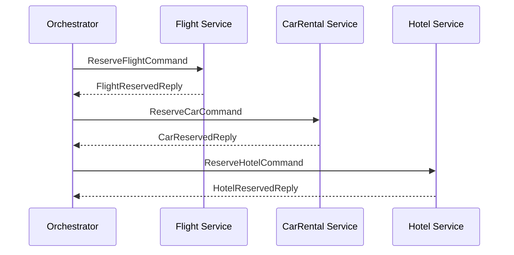
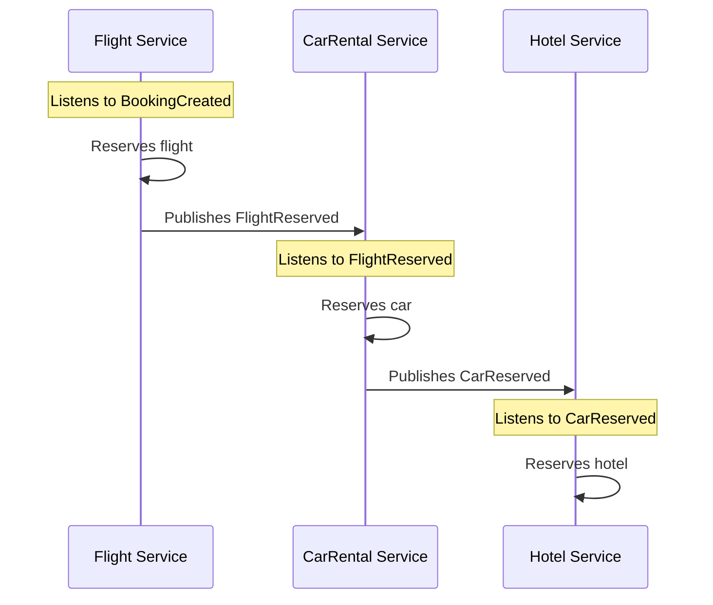
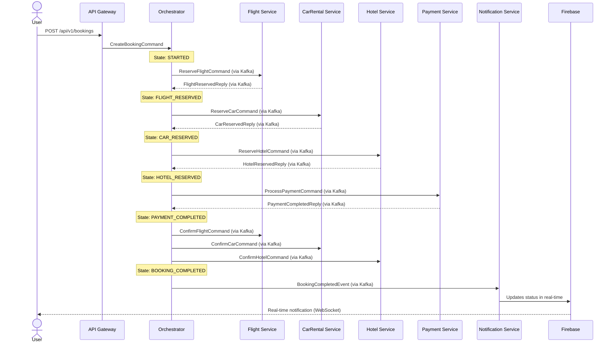
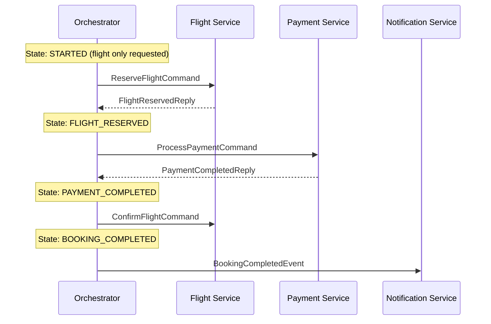
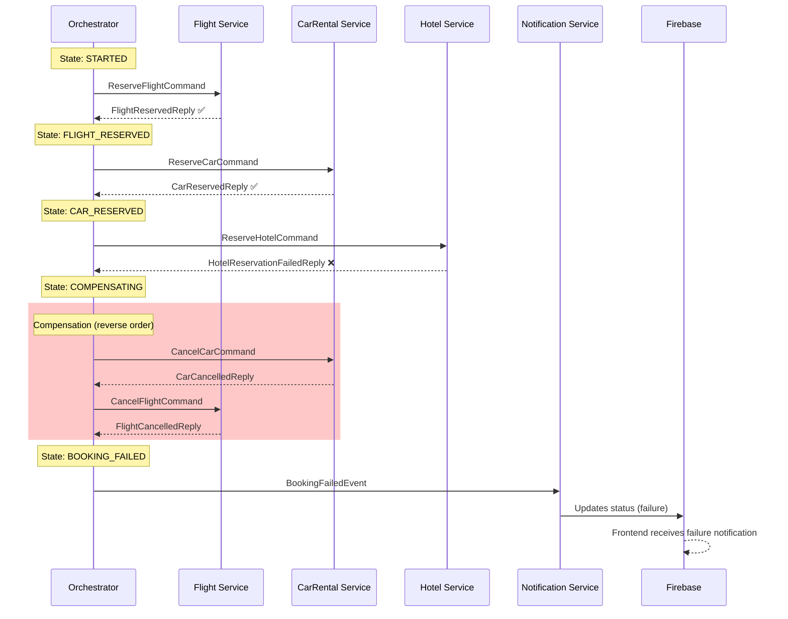
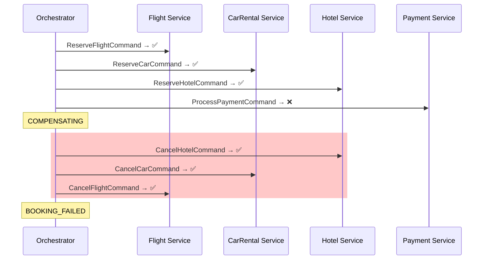
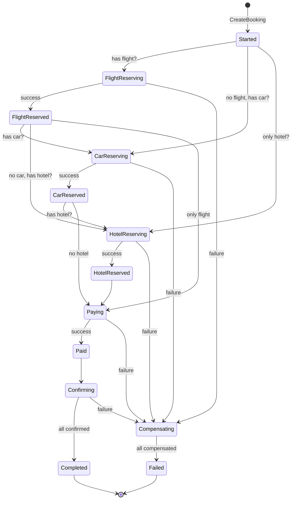

# SAGA Pattern

## What is the SAGA Pattern?

The SAGA pattern is a solution for managing **distributed transactions** in microservice architectures. In a monolith, we use ACID database transactions. In microservices, where each service has its own database, we need an alternative.

A SAGA is a sequence of **local transactions**. Each transaction updates a service and publishes an event/message to trigger the next transaction. If a transaction fails, the SAGA executes **compensating transactions** to undo previous changes.

## Orchestration vs Choreography

### Orchestration (this project's choice)

A central service (the **Orchestrator**) coordinates all participants. It knows the step order, sends commands to each service, and handles responses.

**Advantages:**
- Centralized and easy-to-understand flow
- Precise control over execution order
- Compensations managed in a single place
- Simplified debugging and monitoring

**Disadvantages:**
- Risk of the Orchestrator becoming a "God Service"
- Single point of failure (mitigated with replicas)
- Logical coupling between Orchestrator and participants

### Choreography (alternative)

Each service reacts to events and publishes new events. There is no central coordinator.

**Advantages:**
- Full decoupling between services
- No single point of failure
- Each service is autonomous

**Disadvantages:**
- Hard-to-trace flow (spread across N services)
- Complex compensations (each service must know what to undo)
- Risk of circular dependencies
- Difficult to debug

### Why we chose Orchestration

For this project, Orchestration was chosen because:
1. The flow is **visible and documentable** in a single place
2. **Compensations** are controlled centrally and predictably
3. Facilitates **Kafka learning** (clear request/reply pattern)
4. More **didactic** for a portfolio (reviewers understand the flow by reading one file)

> See [ADR-001](../adr/001-saga-orchestration.md) for the full decision.

## Business Rule: Flexible Booking

A booking requires **at least 1** of the 3 reservation services:

| Combination | Valid? |
|-------------|--------|
| Flight only | Yes |
| Car only | Yes |
| Hotel only | Yes |
| Flight + car | Yes |
| Flight + hotel | Yes |
| Car + hotel | Yes |
| Flight + car + hotel | Yes |
| None | No |

The Orchestrator builds the SAGA **dynamically**, including only the steps needed for the requested items. `Payment` and `Notification` are always included.

## Full Flow: Happy Path

### Example: Flight + Car + Hotel

### Example: Flight Only

## Compensation Flow

### Example: Hotel fails after Flight and Car reserved

### Example: Payment fails (worst case - everything must compensate)

## SAGA State Machine

## Key Concepts

### Idempotency

All handlers must be **idempotent**: processing the same message multiple times must have the same effect as processing it once. This is crucial because Kafka guarantees **at-least-once delivery**.

**Strategy**: Each command carries a `BookingId` + `CorrelationId`. The service checks whether it has already processed that command before executing.

### Timeout and Retry

- Each SAGA step has a **configurable timeout**
- If the Orchestrator doesn't receive a response within the timeout, it can:
  1. Resend the command (retry)
  2. Start compensation (after N retries)

### Compensation Order

Compensations are executed in **reverse order** of completed steps. This ensures we don't try to cancel something that depends on a later step.

### State Persistence

The Orchestrator persists the SAGA state at every transition. If the Orchestrator crashes and restarts, it can resume in-progress SAGAs from where they left off (Event Sourcing).
